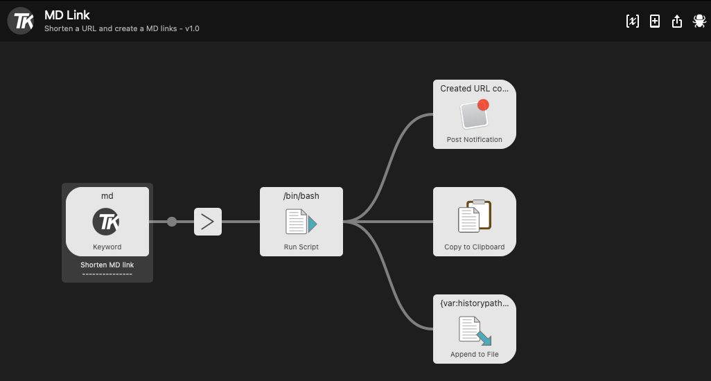

# MD Link
This workflow create a MD link from a given long URL with the title of the requested website and a short URl created with t1p.de.

## Example
  * **Input in Alfred:** `md https://stackoverflow.com`
  * **Output to clipboard:** `[Stack Overflow - Where Developers Learn, Share, &amp; Build Career](https://t1p.de/1il6u)`

Just for your information the output is generated as:
  * Copied to clipboard
  * Displayed as a notification
  * Saved to a md_history.csv (maybe for later use)

Just disable/delete what you don't need.

## Shell Script
I provide the shell scripts as well, you can change it to your prefered URL shortener. See my ShortenURL workflow, where I use tinyURL and is.gd as well.

## URL shortener
As mentioned anove I use [t1p.de](https://www.t1p.de) in this workflow which is free of charge but need an API key and a registration to work. For using this workflow you have to install **jq** as a JSON parser and **wget** on your system. You can easy install **jq** and **wget** via Homebrew https://formulae.brew.sh/formula/jq - just use `brew install jq` respectively `brew install wget`.

This URL shortener respectively the Web UI is available in german only.
