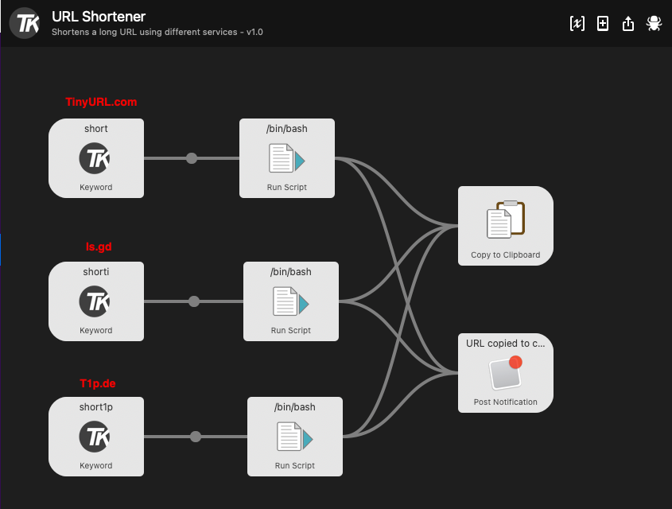

# Shorten URL
This workflow is created with TinyURL as the URL shortener. If you like you can switch to a different one.

I provide two demo scripts for:
  * [is.gd](https://is.gd) which is free
  * [t1p.de](https://www.t1p.de) which is free as well but need an API key to work. This one is available in german only.

Just change the script content of the "Run Script Action" in your workflow. Or create a workflow with all URL shortener together.

